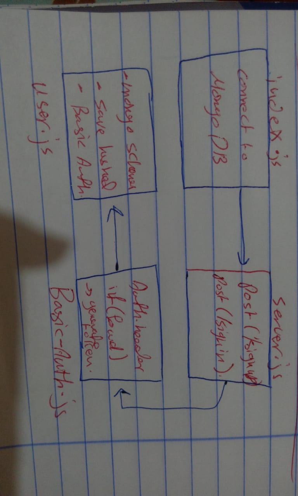

# LAB - Class xx

## Project Name

### Author: Student/Group Name

### Links and Resources

- [submission PR](https://github.com/Saja-401-advanced-javascript/class-11/pull/3)

### Setup

#### `.env` requirements (where applicable)

i.e.

- `PORT` - 9000
- `MONGODB_URI` - mongodb://localhost:27017/LAB11

#### How to initialize/run your application (where applicable)

-`npm start` || `nodemon`
- echo '{"username":"","password":""}' | http post :9000/signup
- http post :9000/signin -a username:password

#### Tests

- How do you run tests?  npm run test || nodemon

#### UML

