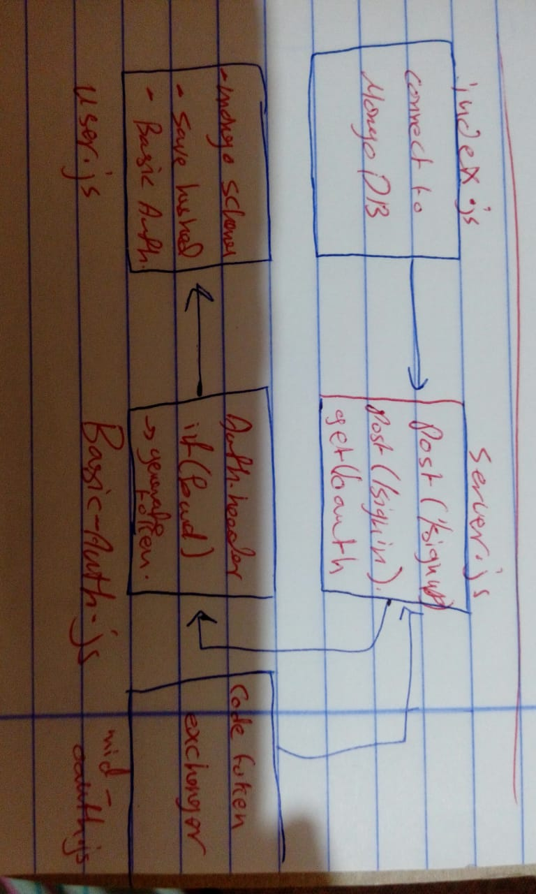

# LAB - Class 12

## OAuth

### Author: Saja Swalgah

### Links and Resources

- [submission PR](https://github.com/Saja-401-advanced-javascript/class-11/pull/4)

### Setup

#### `.env` requirements (where applicable)

- `PORT` - 9000
- `MONGODB_URI` - mongodb://localhost:27017/LAB11

#### How to initialize/run your application (where applicable)

-`npm start` || `nodemon`
- localhost/9000

#### UML

