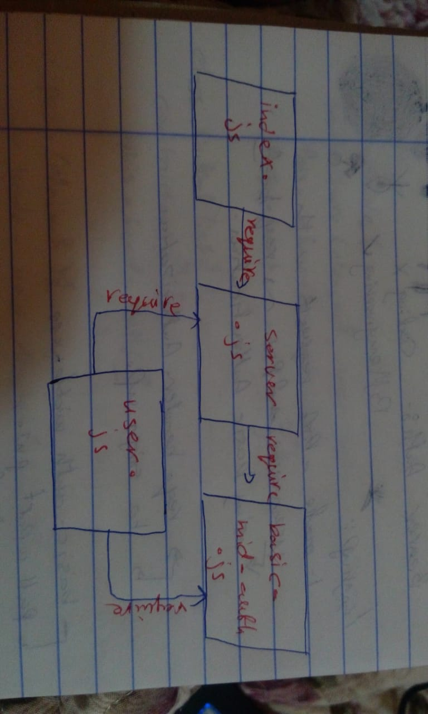

# LAB - Class 11

## Authentication

### Author: Saja Swalgah
### Links and Resources

- [submission PR](https://github.com/Saja-401-advanced-javascript/class-11/pull/2)

#### `.env` requirements (where applicable)

- `PORT` -6000
- MONGOOSE_URI=mongodb://localhost:27017/Auth

#### How to initialize/run your application (where applicable)

-  `npm start`

#### UML

